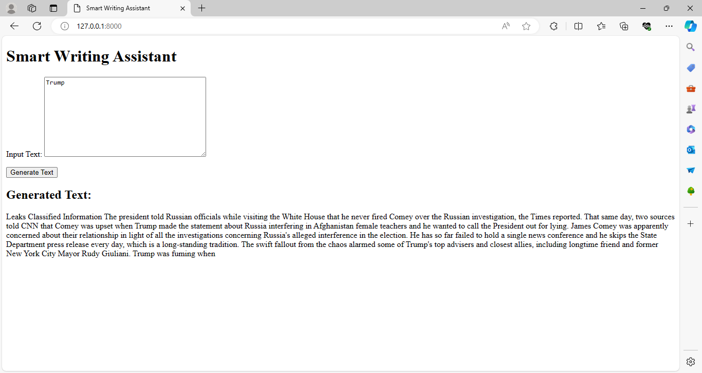

# Smart Assist App
## Overview

Smart Assist is a Django-powered web application that leverages OpenAI's Large Language Model (LLM) to provide users with AI-driven text analysis and insights. The app allows users to input text and receive sentiment analysis, entity recognition, and summary generation.

# Features
Text Genarator: Input text and receive infomration about that person or organisation
Entity Recognition: Identify entities (people, organizations, locations) mentioned in the text
Summary Generation: Get a concise summary of the input text

- User-Friendly Interface: Easy-to-use interface for inputting text and viewing analysis results
# Technical Requirements
- Python 3.8+: Required for running the Django application
- Django 4.1+: Required for building the web application
- OpenAI API Key: Required for accessing OpenAI's LLM (sign up for a free account to obtain an API key)
- 
pip: Required for installing dependencies (listed in requirements.txt)
# Installation
- Clone the repository: `git clone (link unavailable)
- Install dependencies: pip install -r requirements.txt

- Set up Django project: python manage.py migrate
- Set up OpenAI API key: Add your API key to smart_assist/settings.py (see instructions below)

# Run the app: python manage.py runserver
## Configuration
OpenAI API Key: Add your API key to smart_assist/settings.py:
Python
OPENAI_API_KEY = 'YOUR_API_KEY_HERE'
# Usage
Access the app at http://localhost:8000/input/
Input text into the textarea
Click the "Generate" button to receive analysis results
Contributing
Contributions are welcome! Please open a pull request to submit changes or suggest new features.
License
This project is licensed under the MIT License. See LICENSE for details.
# Acknowledgments
OpenAI for providing the Large Language Model (LLM) API
Django for providing the web framework

# AUTHOR
- Simanga Mchunu